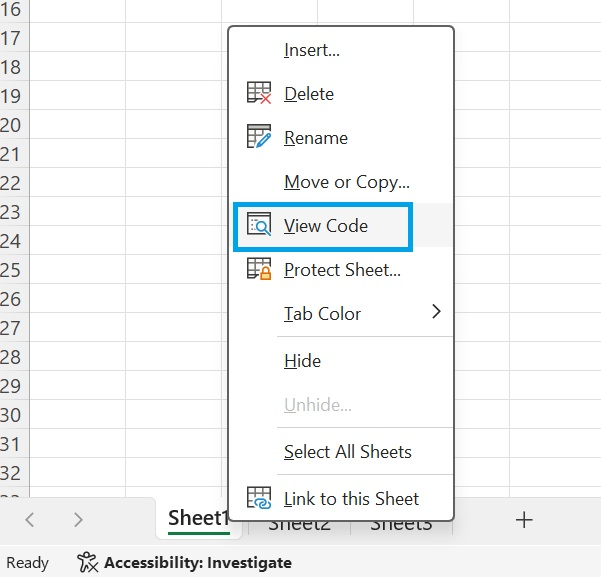
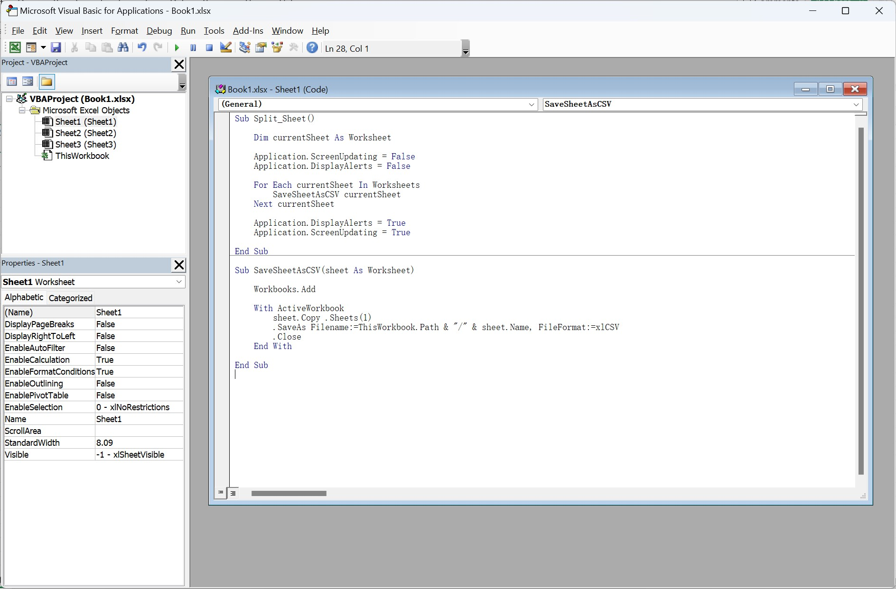

# Excel Sheet Splitter
This is a VBA project for splitting each worksheet in an Excel workbook into separate CSV files.

## Features
- Splits each worksheet in an Excel workbook into a separate CSV file.
- Each CSV file is named after the original worksheet.
- During the splitting process, screen updates and alert prompts are turned off to increase the efficiency of the code execution.

## How to Use
1. Right-click on a sheet at the bottom of the Excel window and click on the "View Code" button.
   
2. This will open the Excel VBA editor.
3. Copy the code from the `main.vbs` file in the repository into the VBA editor.
   
4. Run the `Split_Sheet` subroutine.
5. In the folder where your Excel workbook is located, you will find CSV files named after each worksheet.

## Note
Screen updates and alert prompts in Excel will be turned off during execution to increase code efficiency. Please ensure that you have saved and closed all important Excel workbooks before running these codes.

If you do not need to save the files as CSV, you can remove `FileFormat:=xlCSV` from the following line of code:
```
.SaveAs Filename:=ThisWorkbook.Path & "/" & sheet.Name, FileFormat:=xlCSV
```
By doing so, the files will be saved in the default Excel format (.xlsx).
